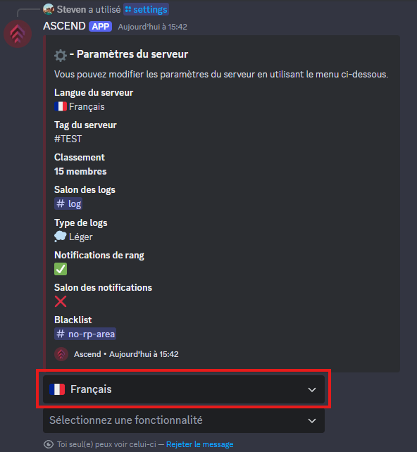

# Langue

Pour changer la langue utilisée par le bot pour les notifications sur votre serveur, utilisez la commande `/settings`&#x20;


La langue par défaut des notifications est celle configurée pour votre serveur



La langue des commandes affichées par le bot correspond automatiquement à la langue de votre client Discord


<figure><figcaption></figcaption></figure>

