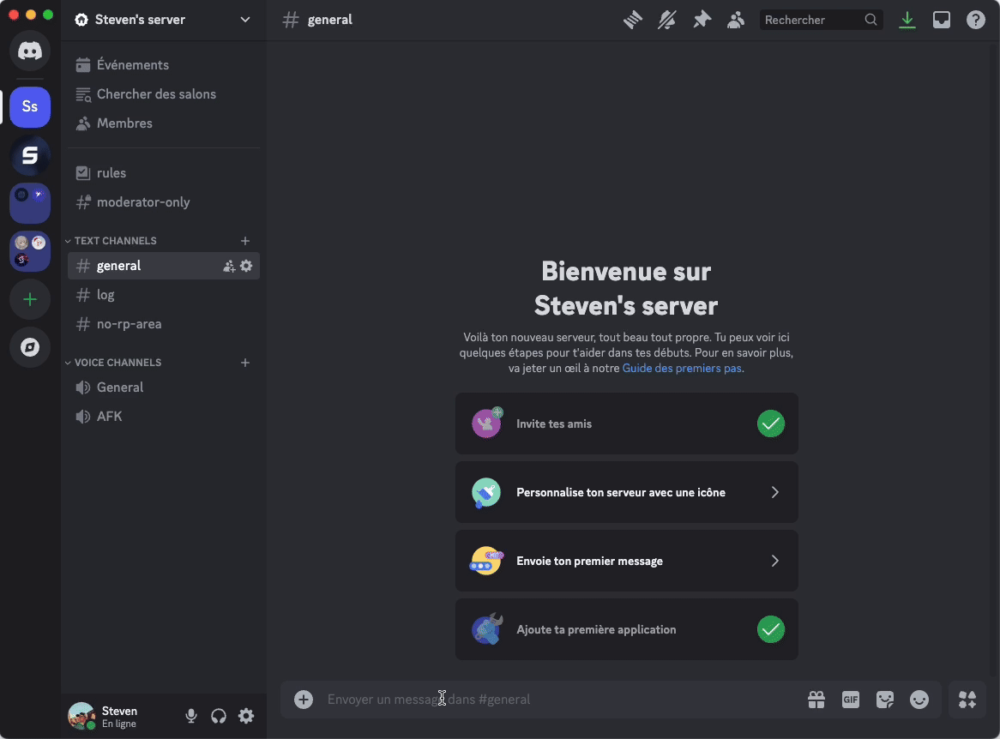

# Salon des logs

L'option **"Salon de log"** vous permet de définir dans quel salon de votre serveur Discord seront envoyés les logs. Ces derniers affichent uniquement le nombre de **RP gagnés ou perdus** par vos membres en fonction de leur activité.

## **Comment définir un salon pour les logs ?**

1. Accédez à la commande `/settings` et sélectionnez **Logs**.
2. Dans le menu déroulant, choisissez le salon de votre serveur où les logs seront affichés.
3. Cliquez sur **Enregistrer** pour confirmer votre choix.

Dès que le salon est configuré, le bot enverra automatiquement les informations concernant les RP gagnés ou perdus par vos membres dans ce salon.


Vous avez la possibilité de choisir le style d'affichage des logs entre Embed et Message simple, [Découvrez comment personnaliser le style des logs](type-de-logs.md).


<figure><figcaption></figcaption></figure>

### **Que se passe-t-il si je ne configure pas de salon de log ?**

Sans configuration, les informations sur les RP ne seront pas enregistrées dans un salon. Vous devrez définir un salon pour profiter de cette fonctionnalité.

### **Les logs peuvent-ils afficher autre chose que les RP gagnés ou perdus ?**

Non, les logs sont spécifiquement conçus pour suivre l'évolution des RP des membres.

### **Puis-je changer le salon plus tard ?**

Bien sûr ! Vous pouvez modifier le salon de log à tout moment via la commande `/settings`.
