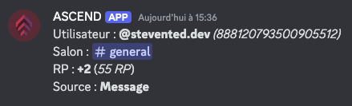
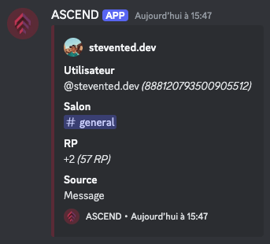

# Type de logs

L'option **"Type de Logs"** vous permet de personnaliser le style d'affichage des logs dans le salon configuré pour les logs. Choisissez entre un format **léger** ou **complet** selon vos préférences et les besoins de votre communauté.

## Comment modifier le type de logs ?

1. Accédez à la commande `/settings` et sélectionnez **Type de Logs**.
2. Dans le menu déroulant, choisissez le style d'affichage que vous préférez :
   * **Léger** : les logs s'affichent sous forme de messages simples, parfaits pour un format rapide et sans distraction.
   * **Complet** : les logs utilisent des embeds, une présentation visuelle structurée et plus détaillée.
3. Cliquez sur **Enregistrer** pour appliquer les changements.


Dès que vous modifiez ce paramètre, les prochains logs affichés respecteront le style que vous avez sélectionné.


<figure><figcaption></figcaption></figure>

## Exemples des styles disponibles

* **Léger :**&#x20;

<figure><figcaption></figcaption></figure>

* **Complet** (Embed) :&#x20;

<figure><figcaption></figcaption></figure>

### **Puis-je changer le style à tout moment ?**

Oui, vous pouvez basculer entre les styles **Léger** et **Complet** à tout moment via la commande `/settings`.

### **Le changement affecte-t-il les anciens logs ?**

Non, le changement de style n’a pas d’effet rétroactif. Seuls les nouveaux logs seront affichés dans le style choisi.
