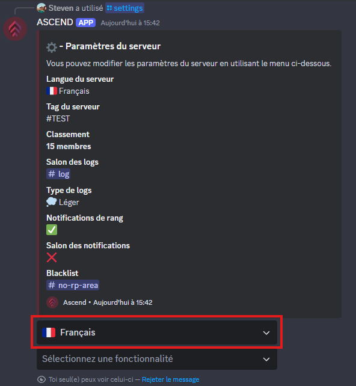

# Language

To change the language used by the bot for notifications on your server, use the `/settings` command.


The default language for notifications is the one set for your server.



The language of the bot's displayed commands automatically matches your Discord client’s language.


<figure><figcaption></figcaption></figure>

