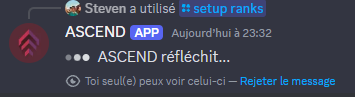

# Setup ranks

## Setup ranks

By default, the bot does not automatically create roles. To set up ranks, you need to run the following command `/settings > Ranks > Setup Ranks`

Roles are optional and not required for the bot to function properly.


Running this command may take approximately **20 seconds to complete**.


<figure><figcaption></figcaption></figure>

Once the roles have been successfully created, the bot will display the following message :

<figure><figcaption></figcaption></figure>


Once the roles are created, **do not delete them** to avoid any malfunctions due to their absence. However, you are **free to rename** the roles or **change their colors** as you wish—this will not affect the bot’s functionality.


***

## Edit a Role

If you accidentally deleted a role or want to add an additional role, you can easily manage them using the `/settings` command.



### Run `/settings`  then select "Ranks" option

<figure><figcaption></figcaption></figure>



### Choose the rank you want to modify or assign roles to.

<figure><figcaption></figcaption></figure>



### Select the role(s) to associate with the chosen rank

<figure><figcaption></figcaption></figure>



## Why Does a Rank Role Without a Number Exist (e.g., Bronze)?&#x20;

These roles are created for two main reasons:

* **Organization**: They help separate members in the server member list for better visibility.&#x20;
* **Permissions**: They allow easy assignment of permissions to a group of ranks.&#x20;

You **can delete** these roles if you prefer, but affected members will no longer receive them when they reach the corresponding rank.

## How Rank Roles Work

The bot **automatically** manages roles assigned to members:

* A member will always keep the last role(s) linked to their **current rank**.
* Roles from lower ranks will be **automatically removed**.

**Example:**

A member with the rank **Gold 2** will have the following roles:\
✅ **Gold**\
✅ **Gold 2**\
❌ **Bronze, Silver, etc.** (These will be removed)

## **Frequently Asked Questions**

#### **Can I customize role names?**

Yes! You can rename roles, and it won’t affect their functionality in the bot.

#### **What happens if I delete a role?**

If a role is deleted, members will **no longer receive it** when they reach the corresponding rank.

#### **How can I assign specific permissions to roles?**

* Set up permissions directly in **Discord** for each role.
* Use **tier roles** (e.g., **Bronze**) to grant **global** permissions to a group of ranks.
